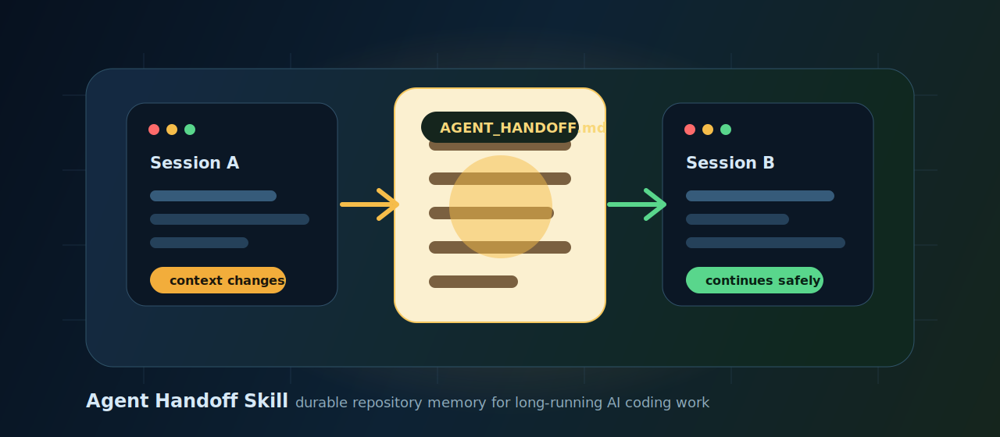
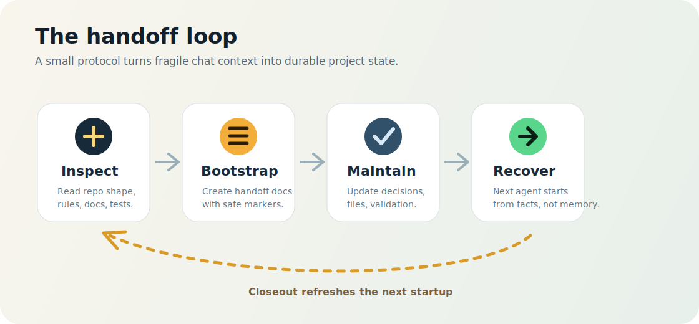
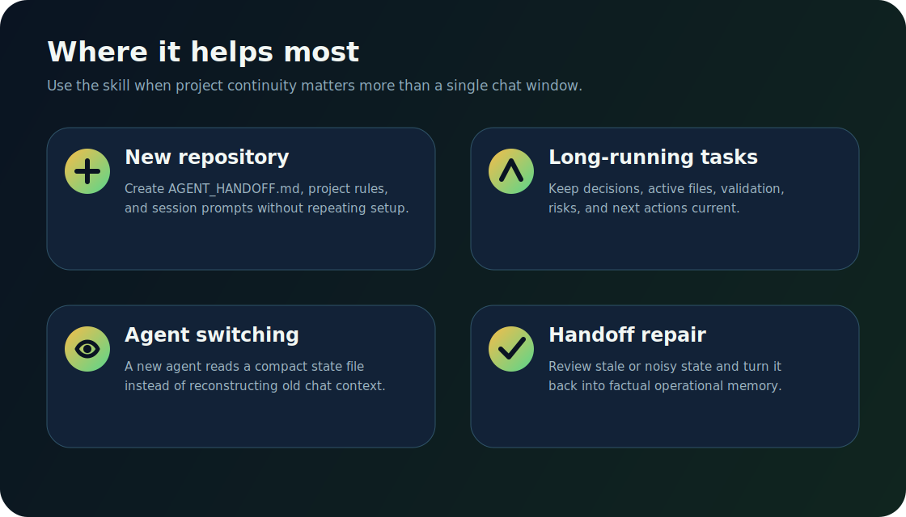

# Agent Handoff Skill

[中文](README.md) | [English](README_en.md)



A **durable handoff mechanism skill** for Codex, Claude Code, and other AI coding agents.

The problem is simple: AI agents can be powerful, but a chat window is not reliable project memory. Context gets compressed, sessions end, agents change, but the engineering work still needs to continue. `agent-handoff` turns the state that used to live in "the previous agent's head" into repository-local documentation that can be maintained, verified, and handed to the next agent.

It is not a chat-summary tool, and it is not a dumping ground for every historical detail. It is closer to a lightweight project flight recorder: it keeps the current objective, status, active files, key decisions, validation results, risks, blockers, and next actions in a compact form so the next agent can continue safely.

## Platform Compatibility

This repository is not Codex-only. It uses the common `SKILL.md + references/ + scripts/` structure and can be installed under each tool's discovery path:

| Platform | Install location | Invocation |
| --- | --- | --- |
| Codex | `~/.codex/skills/agent-handoff` | Codex can trigger the skill from its description, or the user can explicitly request it. |
| Claude Code personal Skill | `~/.claude/skills/agent-handoff` | Claude Code can discover it automatically, or you can invoke `/agent-handoff`. |
| Claude Code project Skill | `<repo>/.claude/skills/agent-handoff` | Active only for that repository; useful for team-shared workflows. |

The `agents/openai.yaml` file is Codex UI metadata. Claude Code does not need it. Keeping it in the repository should not affect Claude Code's ability to use the skill.

## Why This Skill Exists

When AI coding agents are used on real projects over long periods, the hardest failure mode is often not "the agent cannot write code." The real breakpoints are usually more operational:

- A new chat opens, and the agent no longer knows where the previous session actually stopped.
- A previous agent made technical decisions, but the reasons and evidence were never recorded.
- The user says "continue," but the current objective, active files, and validation state are buried in old chat context.
- A complex task spans multiple days, modules, and interruptions, and nobody can confidently say what is already done.
- A handoff document slowly turns into a chat transcript, forcing the next agent to read more irrelevant material.
- The repository has `CLAUDE.md`, `AGENTS.md`, `.claude/CLAUDE.md`, or similar guidance files, but every project handles continuity differently.

`agent-handoff` packages those lessons into a reusable skill. It guides an agent to create or repair a stable handoff mechanism inside a repository, and it includes an idempotent bootstrap script so you do not need to keep copying large prompts or manually stitching templates together.

It also writes a stricter file-reading protocol into project rules: `Read` ranges stay below 240 lines by default, `offset` is treated as a line number, and agents must stop paging with `Read` after offset drift, empty output, stale snippets, or API termination, then re-anchor with search or read-only shell inspection before acting.

## What It Creates

The default mechanism is now a **multi-document layout**, while the legacy single-document layout remains supported.

| File | Purpose |
| --- | --- |
| `AGENT_HANDOFF.md` | In multi layout, the index and recovery route. In single layout, the full handoff state file. |
| `.agent-handoff/snapshot.md` | Current objective, status, next actions, active files, blockers, and open questions. |
| `.agent-handoff/workspace.md` | Repository map, entry points, test commands, docs, and stable project context. |
| `.agent-handoff/decisions.md` | Important decisions with reasons and evidence. |
| `.agent-handoff/work-log.md` | Recent operational work log. |
| `.agent-handoff/validation.md` | Validation commands, results, failures, and intentionally skipped checks. |
| `.agent-handoff/backlog.md` | Pending work and follow-ups. |
| `.agent-handoff/risks.md` | Risks, blockers, `UNKNOWN` items, and confirmations needed. |
| `.agent-handoff/archive.md` | Compressed old history that is not part of normal recovery. |
| `AGENTS.md` | Codex project instructions file. Stores the handoff maintenance rules that Codex reads for the repository. |
| `.claude/CLAUDE.md` | Recommended project-level Claude Code rules. Requires future agents to read and maintain the handoff document. |
| `AGENT_SESSION_PROMPTS.md` | Optional reusable prompts for new-window startup, task continuation, closeout, and handoff quality review. |
| `.claude/settings.json` | Optional. Merges safe read-only query permissions or Claude Code soft reminder hook entries only when the user asks for them. |
| `.claude/hooks/handoff-watch.mjs` | Optional Claude Code hook script, created only when `--install-hooks` is explicitly used. |
| `.gitignore` | Optional. Keeps local handoff files uncommitted unless the project decides to version them. |

The core rule is **idempotency**. Project-level handoff rules are wrapped in stable markers:

```markdown
<!-- AGENT_HANDOFF_PROTOCOL:START -->
...
<!-- AGENT_HANDOFF_PROTOCOL:END -->
```

If the markers already exist, the marked block is replaced. If they do not exist, the block is appended. The same protocol should not be duplicated every time the setup runs.

## How It Works



The skill creates a loop:

1. **Inspect**: Read the repository shape before writing templates.
2. **Bootstrap**: Create or merge the necessary handoff files and project rules.
3. **Maintain**: During work, record objectives, decisions, active files, validation, and risks.
4. **Closeout**: Before finishing any non-trivial task, refresh `AGENT_HANDOFF.md` or the relevant `.agent-handoff/` files.
5. **Recover**: The next agent starts from the handoff document, then reads only the source files needed for the current task.

The point is not to make agents read less source code. The point is to make agents read less irrelevant history. `AGENT_HANDOFF.md` tells the next agent where to start reading. Implementation details still need to be verified from source files and tests.

In multi-document layout, the recovery reading order is:

1. `AGENT_HANDOFF.md`
2. `.agent-handoff/snapshot.md`
3. `.agent-handoff/risks.md`
4. `.agent-handoff/backlog.md`
5. `.agent-handoff/validation.md`, only when validation state affects the current task
6. `.agent-handoff/decisions.md`, only when changing architecture, behavior, dependencies, or prior decisions
7. `.agent-handoff/workspace.md`, only when orientation, commands, or subproject boundaries are needed
8. `.agent-handoff/work-log.md`, only when recent implementation details are needed
9. `.agent-handoff/archive.md`, only when old context is explicitly needed

## Main Use Cases



### 1. Initializing a New Repository

When you open a new repository and want future agents to maintain continuity automatically, ask Codex to use this skill:

```text
Use the agent-handoff skill to initialize a handoff mechanism for the current project.
```

The agent should inspect the repository, create `AGENT_HANDOFF.md`, and merge Durable Handoff rules into the platform-specific project instruction files:

- Codex: `AGENTS.md`
- Claude Code: `.claude/CLAUDE.md`

Good fits:

- New SaaS projects
- Multi-module monorepos
- Client projects that will be maintained over time
- Repositories where AI agents or chat windows are frequently switched

### 2. Continuing Long Tasks Across Windows

A single feature can span multiple sessions:

- Day 1: analyze architecture and plan the approach.
- Day 2: implement backend APIs.
- Day 3: wire up frontend and tests.
- Day 4: fix validation failures and edge cases.

Without a handoff mechanism, the new agent has to reconstruct the task from old chat history. With `AGENT_HANDOFF.md`, it can see:

- The current objective.
- The active files.
- Decisions that were made.
- Validation commands that were run.
- Tests that were not run, and why.
- Remaining risks and next steps.

To continue, you can say:

```text
Read AGENT_HANDOFF.md and continue the current task.
```

If you have seen an agent answer `No response requested.` or silently stop after `Continue from where you left off.`, use a more explicit continuation prompt:

```text
Continue the previous task. Do not answer "No response requested" and do not stop silently. First state where you believe the previous turn stopped and what the next concrete action is, then continue. If context is insufficient, read AGENT_HANDOFF.md and the necessary handoff files to recover state.
```

### 3. Recovering After Agent Switching or Context Compression

When chat context is compressed or a new agent takes over, the dangerous case is an agent that appears to understand the project but is missing key state. This skill's rules require the new agent to:

1. Read `AGENT_HANDOFF.md` first.
2. Identify the current objective, status, next action, and blockers.
3. Read only source files relevant to the current task.
4. Treat the handoff document as continuity memory, not as a substitute for source truth.

This reduces two common risks:

- Repeating work that has already been completed.
- Continuing from stale or misunderstood context.

### 4. Repairing and Compressing Handoff Documents

Many teams start with a handoff file, but over time it can become:

- A chat summary.
- A long log dump.
- Vague notes without paths.
- Decisions without reasons.
- Stale backlog items.
- Contradictory status entries.

Use:

```text
Use the agent-handoff skill to review and repair the current project's AGENT_HANDOFF.md.
```

The skill uses `references/quality.md` to turn noisy state back into factual operational memory.

## Installation

### Option 1: Install as a Local Codex Skill

Clone or copy this repository into your Codex skills directory:

```powershell
git clone https://github.com/<your-name>/agent-handoff-skill.git C:\Users\<you>\.codex\skills\agent-handoff
```

If you already have it locally:

```powershell
Copy-Item -Recurse -Force E:\_workspace\agent-handoff-skill C:\Users\<you>\.codex\skills\agent-handoff
```

Then start a new Codex session and ask:

```text
Use the agent-handoff skill to initialize a handoff mechanism for the current project.
```

### Option 2: Install as a Claude Code Personal Skill

Clone or copy this repository into Claude Code's personal skills directory:

```powershell
git clone https://github.com/<your-name>/agent-handoff-skill.git C:\Users\<you>\.claude\skills\agent-handoff
```

If you already have it locally:

```powershell
Copy-Item -Recurse -Force E:\_workspace\agent-handoff-skill C:\Users\<you>\.claude\skills\agent-handoff
```

Then in Claude Code, you can say:

```text
Use the agent-handoff skill to initialize a handoff mechanism for the current project.
```

Or invoke it explicitly:

```text
/agent-handoff initialize a handoff mechanism for the current project
```

### Option 3: Install as a Claude Code Project Skill

If you want the skill to travel with a repository and be available to teammates, install it under the target project:

```powershell
mkdir .claude\skills
git clone https://github.com/<your-name>/agent-handoff-skill.git .claude\skills\agent-handoff
```

Use project-level installation for team-standard workflows. Use personal installation when you want the skill available across all of your projects.

### Option 4: Use Only the Script

You can also run the bootstrap script directly:

```powershell
python scripts\bootstrap_handoff.py --repo E:\path\to\your\repo --platform both --layout multi --session-prompts --gitignore
```

Common flags:

| Flag | Description |
| --- | --- |
| `--repo <path>` | Target repository root. Defaults to the current directory. |
| `--platform codex\|claude\|both` | Project rule target. `codex` updates `AGENTS.md`, `claude` updates `.claude/CLAUDE.md`, and `both` updates both. |
| `--layout single\|multi` | Handoff structure. `multi` is the recommended default; `single` preserves the legacy one-file layout. |
| `--session-prompts` | Create `AGENT_SESSION_PROMPTS.md` if missing. |
| `--gitignore` | Add `AGENT_HANDOFF.md` and `AGENT_SESSION_PROMPTS.md` to `.gitignore`. |
| `--allow-readonly` | Claude Code only: merge safe read-only query permissions into `.claude/settings.json`. |
| `--install-hooks` | Claude Code only: install optional soft reminder hooks and merge missing hook entries into `.claude/settings.json`. |
| `--dry-run` | Show planned changes without writing files. |
| `--skip-codex-rules` | Do not create or update `AGENTS.md`. |
| `--skip-claude-rules` | Do not create or update `.claude/CLAUDE.md`. |

Example:

```powershell
python scripts\bootstrap_handoff.py --repo E:\_workspace\my-saas --platform both --layout multi --session-prompts --gitignore --dry-run
```

Review the output, then rerun without `--dry-run`.

## Usage Examples

### Initialize a Project

User:

```text
Use the agent-handoff skill to establish a durable handoff mechanism for the current project.
```

Expected agent behavior:

1. Inspect the project structure.
2. Look for existing `CLAUDE.md`, `AGENTS.md`, and `.claude/CLAUDE.md`.
3. Create or update `AGENT_HANDOFF.md`.
4. Idempotently merge the Codex handoff block into `AGENTS.md`.
5. Idempotently merge the Claude Code handoff block into `.claude/CLAUDE.md`.
6. Optionally create `AGENT_SESSION_PROMPTS.md`.
7. Re-read the changed files.
8. Report what was created, current status, and remaining `UNKNOWN` entries.

### Repair an Existing Handoff

User:

```text
Use the agent-handoff skill to repair AGENT_HANDOFF.md. It is too long and the state is messy.
```

Expected agent behavior:

1. Read `references/quality.md`.
2. Read the current `AGENT_HANDOFF.md`.
3. Check for content that conflicts with repository facts.
4. Compress stale history.
5. Refresh Snapshot, Work Log, Validation History, and Backlog.
6. Preserve evidence-backed decisions and remove chat-transcript noise.

### Merge Read-Only Query Permissions

User:

```text
Use the agent-handoff skill and make future read/query operations require less manual approval.
```

The agent can run:

```powershell
python scripts\bootstrap_handoff.py --repo . --allow-readonly
```

This only merges safe local read/search/inspection permissions into Claude Code's `.claude/settings.json`, such as `Read`, `Grep`, `Glob`, `rg`, `git status`, and `git diff`. It does not allow writing, deleting, installing dependencies, network access, starting services, or database changes.

### Install Claude Code Soft Reminder Hooks

User:

```text
Use the agent-handoff skill and add Claude Code handoff closeout reminder hooks.
```

The agent can dry-run first:

```powershell
python scripts\bootstrap_handoff.py --repo . --install-hooks --dry-run
```

Then apply:

```powershell
python scripts\bootstrap_handoff.py --repo . --install-hooks
```

This creates `.claude/hooks/handoff-watch.mjs` and merges missing `SessionStart`, `Stop`, and `SubagentStop` hook entries into `.claude/settings.json`. The hook is advisory only: it emits no stdout when the handoff state is clean; emits `continue: true` and `systemMessage` when a reminder is needed; always exits `0`; and will not terminate the session if `AGENT_HANDOFF.md` is missing or the check fails unexpectedly.

## Repository Structure

```text
agent-handoff/
  SKILL.md
  README.md
  README_en.md
  agents/
    openai.yaml
  assets/
    readme/
      hero.svg
      workflow.svg
      scenarios.svg
  templates/
    claude-settings-hooks.json
    handoff-watch.mjs
  references/
    codex-rules.md
    claude-rules.md
    hooks.md
    quality.md
    templates.md
  scripts/
    bootstrap_handoff.py
```

Multi layout creates this structure in the target project:

```text
AGENT_HANDOFF.md
.agent-handoff/
  snapshot.md
  workspace.md
  decisions.md
  work-log.md
  validation.md
  backlog.md
  risks.md
  archive.md
```

Responsibilities:

- `SKILL.md`: Runtime entry point. Keep it short. It contains trigger description, workflow, resource navigation, and boundaries.
- `references/templates.md`: Templates for `AGENT_HANDOFF.md` and `AGENT_SESSION_PROMPTS.md`.
- `references/codex-rules.md`: Codex `AGENTS.md` handoff rule block.
- `references/claude-rules.md`: Claude Code `.claude/CLAUDE.md` handoff rule block.
- `references/hooks.md`: Optional Claude Code hook reminder examples. Hooks must always exit `0`, never return `decision: "block"` or `continue: false`, and never block or close the session.
- `templates/claude-settings-hooks.json`: Claude Code `.claude/settings.json` hook snippet template for manual merge or script installation.
- `templates/handoff-watch.mjs`: Claude Code handoff reminder hook script template.
- `references/quality.md`: Quality standards for reviewing, repairing, and compressing handoff documents.
- `scripts/bootstrap_handoff.py`: Conservative setup script. Creates missing files, single or multi handoff layouts, idempotently merges rules, and can optionally install Claude Code soft reminder hooks.
- `README.md` / `README_en.md`: GitHub documentation. Not required at runtime.

## Design Principles

### 1. Repository Facts First

The handoff document must not invent facts. If a fact cannot be verified, write `UNKNOWN` and leave a way to resolve it.

Bad:

```markdown
- The project uses Next.js and PostgreSQL.
```

Better, if you have not checked the source/configuration:

```markdown
- UNKNOWN: Backend/database stack needs confirmation from repository files.
```

### 2. State Matters More Than History

`AGENT_HANDOFF.md` is not a chat log. It should answer:

- What is the current objective?
- What is the current status?
- What should happen next?
- Which files are relevant?
- Which important decisions were made?
- What validation was run?
- What risks remain?

### 3. The Next Agent Must Consume It Quickly

A good handoff lets a new agent recover within minutes. Stale information should be compressed, contradictions should be removed, and long logs should be summarized.

### 4. Idempotent Updates, No Duplicate Blocks

Project-level rules are managed with markers. Running setup again should replace the existing marked block, not append another copy.

### 5. Do Not Modify User-Level Config by Default

The default behavior is project-local. Do not automatically modify user-level configuration such as `~/.codex/AGENTS.md` or `~/.claude/CLAUDE.md` unless the user explicitly asks.

### 6. Stable Reading Before Blind Paging

Generated `AGENTS.md` and `.claude/CLAUDE.md` rules require agents to read files in small, anchored ranges. Read `offset` must be treated as a line number. If Read returns empty output, offset warnings, inconsistent line numbers, `file is shorter than the provided offset`, or an API termination after a Read attempt, the agent must stop paging with Read and re-anchor with `rg -n`, `wc -l`, `sed -n`, or another read-only inspection command.

## Quality Checklist

A good `AGENT_HANDOFF.md` should satisfy:

- A new agent can quickly understand the current objective and next action.
- Paths can be located from the repository root.
- Current status, backlog, and blockers do not contradict each other.
- Important decisions include reasons and evidence.
- Validation history states what was run, what happened, and what limitations remain.
- It contains no secrets, long logs, full code blocks, or chat transcripts.
- Unknown information is marked as `UNKNOWN`.
- It reduces irrelevant reading but does not replace source verification.

Multi-document layout must also satisfy:

- `AGENT_HANDOFF.md` is only an index and recovery route, not a task log.
- `snapshot.md` is short and explains current objective, status, next action, active files, and blockers.
- `risks.md` contains all active risks, blockers, and `UNKNOWN` items.
- `backlog.md` contains actionable pending work, not completed stale items.
- `validation.md` clearly records passed, failed, and not-run checks.
- `decisions.md` includes reasons and evidence for every durable decision.
- A new agent can recover the previous agent's state by reading the index, snapshot, risks, backlog, and only the necessary validation/decision files.

## Notes

- If the project commits `AGENT_HANDOFF.md`, be careful not to include private context, sensitive paths, logs, or internal information.
- If the project gitignores the handoff document, make sure the team understands that it is local state.
- Hooks are optional reinforcement. They should not replace the agent's responsibility to close out properly; the default setup does not install hooks, and only explicit `--install-hooks` writes `.claude/hooks/handoff-watch.mjs` and merges `.claude/settings.json`.
- If the target project already has an unmarked `.claude/hooks/handoff-watch.mjs`, the script preserves it and does not wire settings to that unverified script, avoiding accidental use of custom hooks that might block a session.
- `bootstrap_handoff.py` does not overwrite an existing `AGENT_HANDOFF.md`; existing state must be repaired from repository facts.

## License

Use this under your repository's license. If the repository does not have a license yet, consider adding an explicit open-source license such as MIT.
